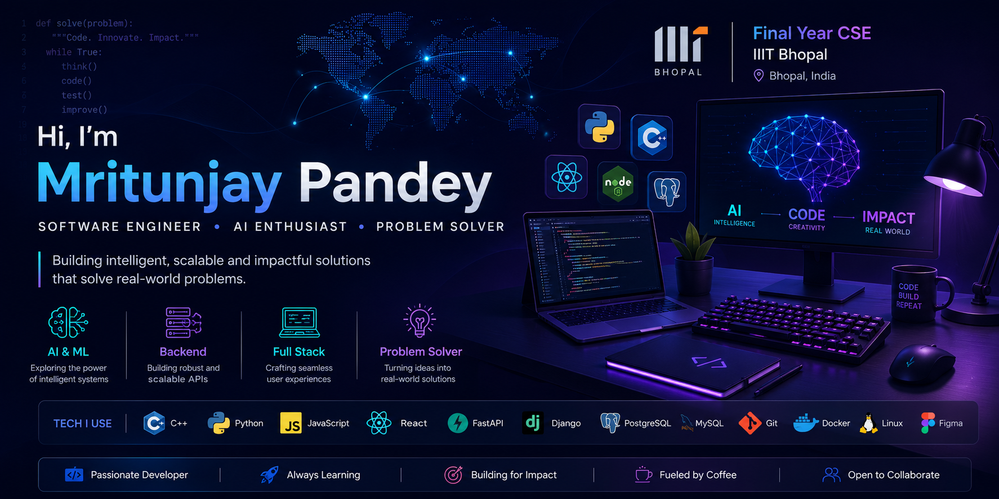
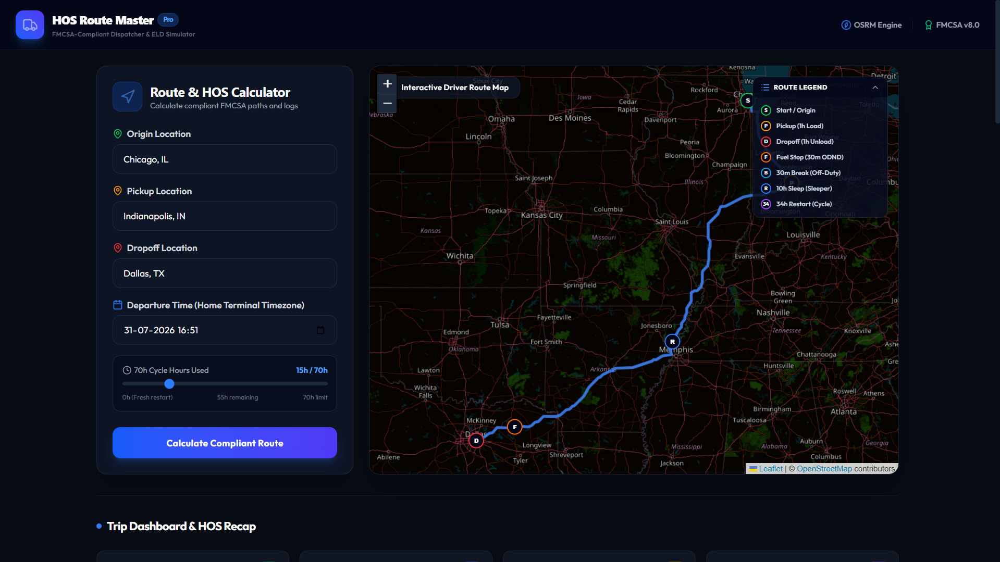
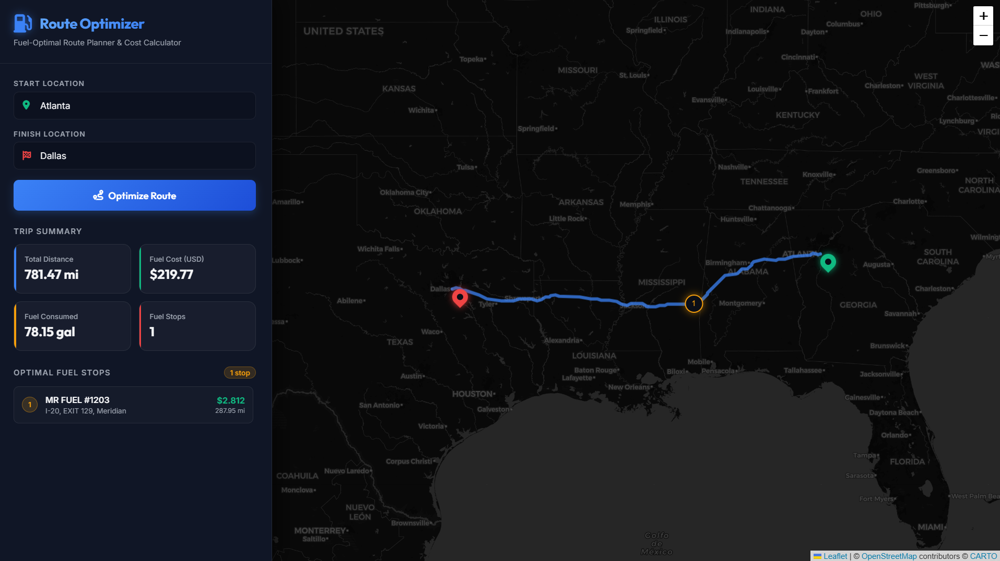
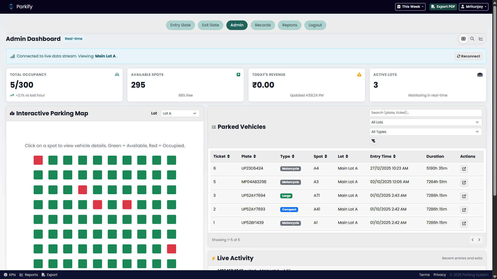
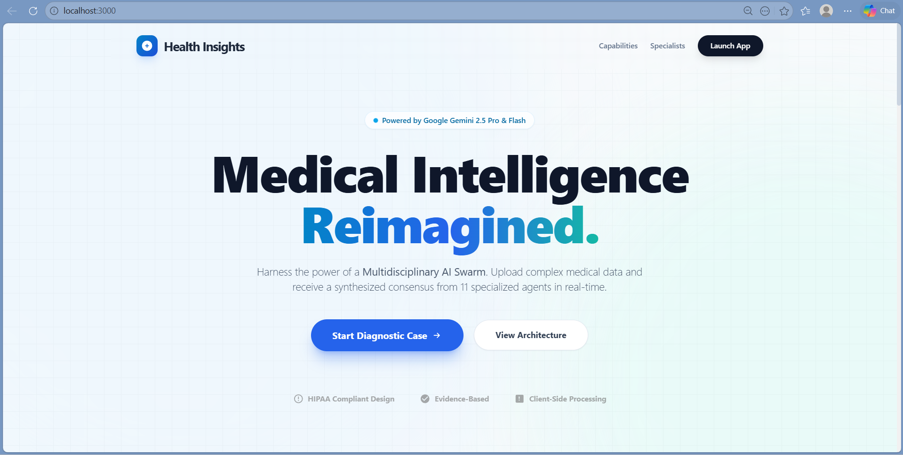

<p align="center">
  
</p>

<h1 align="center">Hi 👋, I'm Mritunjay Pandey</h1>

<h3 align="center">
Software Engineering Co-op Intern • AI & Backend Developer • Competitive Programmer
</h3>

<p align="center">

</p>

<p align="center">
<a href="https://github.com/PMritunjay1">

</a>

<a href="https://github.com/PMritunjay1?tab=followers">

</a>

<a href="https://github.com/PMritunjay1">

</a>
</p>

<p align="center">

<a href="https://linkedin.com/in/pmritunjay">

</a>

<a href="https://leetcode.com/u/pmritunjay">

</a>

<a href="https://codeforces.com/profile/pmritunjay_">

</a>

<a href="https://www.codechef.com/users/pmritunjay">

</a>

<a href="https://pmritunjay1.github.io/Me/">

</a>

</p>

---


##  About Me

```cpp
class MritunjayPandey {
public:
    string role = "Software Engineering Co-op Intern";
    string education = "IIIT Bhopal";
    vector<string> interests = {
        "Backend",
        "AI",
        "System Design",
        "Open Source"
    };

    string motto = "Build. Learn. Improve. Repeat.";
};
```

- 🎓 Final Year **B.Tech in Computer Science & Engineering** at **IIIT Bhopal**
- 💼 Software Engineering **Co-op Intern**
- 🚀 Passionate about building **AI-powered**, **backend**, and **full-stack** applications
- 🌱 Currently exploring **Machine Learning, Agentic AI, Cloud Computing, and System Design**
- 💡 Love solving real-world problems through software engineering
- 🤝 Open to collaborating on **Open Source**, **AI**, and **Backend** projects
- ⚡ Competitive Programmer who enjoys solving challenging algorithmic problems

---

# 🚀 Featured Projects

<table>
<tr>
<td width="50%">

### 🚚 HOS Route Master



**FMCSA-Compliant Dispatcher & ELD Simulator**

**Tech Stack**

`React` `Python` `OSRM` `Leaflet` `JavaScript`

✅ FMCSA Hours-of-Service Compliance

✅ Interactive Route Planning

✅ Driver Log Simulation

✅ Geospatial Mapping

<b>🔗 Repository</b><br>
<a href="https://github.com/PMritunjay1/hos-route-master-fullstack">View Repository →</a>


<b>🌐 Live Demo</b><br>
<a href="https://hos-route-master-frontend.vercel.app/">Open Demo →</a>

</td>

<td width="50%">

### ⛽ Fuel Route Planner



**Fuel Optimization & Cost Planning System**

**Tech Stack**

`Python` `Django REST` `SciPy` `Leaflet`

✅ Fuel Cost Prediction

✅ Route Optimization

✅ Spatial Search (cKDTree)

✅ Fuel Stop Recommendation

<b>🔗 Repository</b><br>
<a href="https://github.com/PMritunjay1/fuel-route-planner">View Repository →</a>

</td>
</tr>

<tr>
<td width="50%">

### 🩺 Health Insights



**Multi-Agent AI Medical Diagnosis**

**Tech Stack**

`React` `Gemini` `LLMs` `RAG`

✅ AI Swarm Architecture

✅ Multi-Agent Consensus

✅ Clinical Decision Support

✅ Evidence-Based Diagnosis

<b>🔗 Repository</b><br>
<a href="https://github.com/PMritunjay1/Multi-agent-Diagnostic-System">View Repository →</a>


</td>

<td width="50%">

### 🚗 Parkify



**Smart Parking Management Platform**

**Tech Stack**

`FastAPI` `SQLAlchemy` `MySQL`

✅ Live Parking Dashboard

✅ Vehicle Tracking

✅ Revenue Analytics

✅ Interactive Parking Map

<b>🔗 Repository</b><br>
<a href="https://github.com/PMritunjay1/Parkify">View Repository →</a>
<b>🌐 Live Demo</b><br>
<a href="https://parkify-iiit.netlify.app/admin_dashboard.html">Open Demo →</a>


</td>
</tr>

</table>

---

# 🛠️ Tech Stack

### 💻 Languages
<p>
  
</p>

### 🎨 Frontend
<p>
  
</p>

### ⚙️ Backend
<p>
  
</p>

### 🤖 AI / Machine Learning
<p>
  
</p>

<p>
  
  
  
  
  
</p>

### 🗄️ Databases
<p>
  
</p>

### ☁️ DevOps & Tools
<p>
  
</p>

---

# 📊 GitHub Analytics

# 📊 GitHub Analytics

<div align="center">


</div>

<br>

<p align="center">

</p>


---

# 🏆 Competitive Programming

<p align="center">

<a href="https://leetcode.com/u/pmritunjay">

</a>

<a href="https://codeforces.com/profile/pmritunjay_">

</a>

<a href="https://www.codechef.com/users/pmritunjay">

</a>

</p>

---

# 📬 Connect With Me

<p align="center">
<a href="https://linkedin.com/in/pmritunjay">

</a>

<a href="https://pmritunjay1.github.io/Me/">

</a>

<a href="mailto:YOUR_EMAIL">

</a>

</p>
